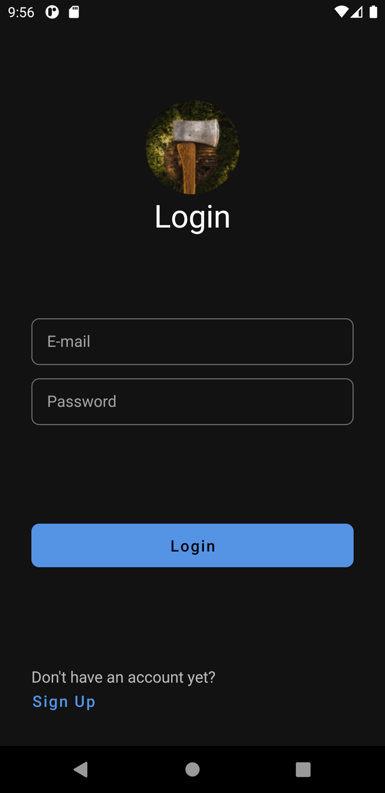
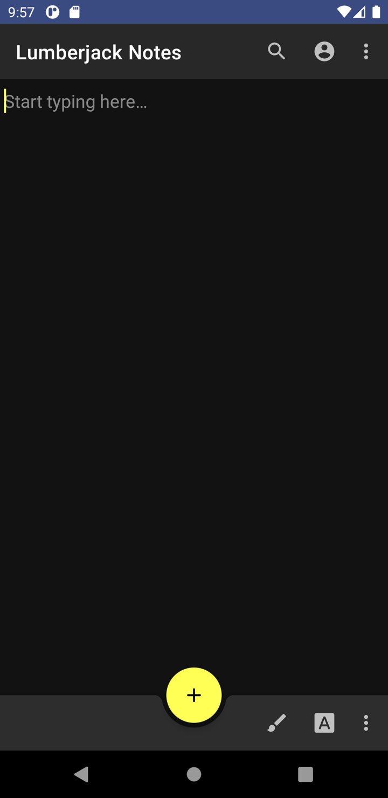
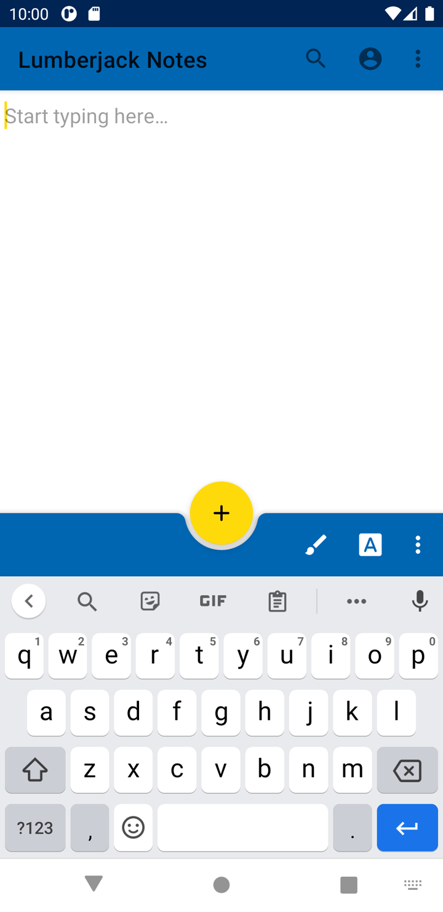

# Implementation
Group 04 - "[Lumberjack Notes]"  
Date and location: March 14, 2021  
Group Members: Gustavo Valencia, Armando Martinez, Stefan Mihailovic, Nicholas Botticelli, Collin Rampata, Kyle Austria

## 1. Introduction

Lumberjack Notes is a free note-taking application designed to help students and professionals collaborate and share
their notes with their colleagues. Our application aims to provide a user-friendly interface with an intuitive
note-taking environment. Users of Lumberjack Notes will have the ability to customize and modify their workspace to fit
their needs. Users will also have the option to share their notes with fellow students or colleagues.

GitHub: https://github.com/CS386-Group-4/LumberjackNotes

Trello: https://trello.com/b/3lbd1jw9/cs-386-notes-app

## 2. Implemented requirements

1. User Story: "As a college student, I want to be able to take notes while still staying actively engaged in class so
that I can grasp information more efficiently and have quality notes to look back through."
    - Priority: 1
    - Estimated Hours: 12

2. User Story: "As a college student, I want an easy to use interface that lets me get to the note-taking part quickly
so that I can make the most out of my time in classes."
    - Priority: 3
    - Estimated Hours: 8

## 3. Adopted technologies

**Android Studio**

The team used the Android Studio IDE to develop Lumberjack Notes. This application is designed specifically for implementing android code and it provides us with an environment to test our Android programs.

**Amazon Web Services**

Amazon Web Services (AWS) hosts our server infrastructure to support the Lumberjack Notes app. AWS provides many
flexible tools and services like DynamoDB to allow for cloud-based functionality for our app.

**DynamoDB**

DynamoDB is an Amazon web service that uses NoSQL to manage Lumberjack Notes’ database. This gives our project
advantages, such as a built-in security service, and back-up and restore options.

## 4. Learning/Training

Our team’s learning strategy is to divide research topics among group members and build a basic “Hello World”
proof-of-concept application using Android Studio to familiarize ourselves with the process of constructing an Android
application. Knowing the basic functions of the IDE will help prepare us for development of the project. Certain group
members researched Cloud-based services and presented their findings to the team. This allowed us to gain a general
understanding of the client-server architecture in Lumberjack Notes.

## 5. Deployment

Our team decided not to include any client-server code for the first implementation of our MVP. Since Lumberjack Notes
does not contain any web-based services yet, we did not have a Docker container to deploy on AWS. Thus, we found it
unnecessary to include a Docker link in this deliverable.

## 6. Licensing

We adopted the MIT license for its simplicity and permissibility, allowing others to modify and redistribute our code freely.

## 7. Readme File

- [README.md](../README.md)
- [CONTRIBUTING.md](../CONTRIBUTING.md)
- [CODE_OF_CONDUCT.md](../CODE_OF_CONDUCT.md)
- [LICENSE](../LICENSE)

## 8. Look & feel

During our interviews, we concluded interviewees wanted a simple and intuitive UI. We designed a simple log-in page
that offers a familiar design. The note-taking environment provides users with a clean and unintrusive design.

At the top of the note-taking environment, the users can find a search and user profile button that will later allow
users to quickly search their notes and review their profile. At the bottom of the environment, users will be able to
customize and use their favorite editing tools in a later update.

When users begin to type their notes, we have designed the toolbar to relocate above the keyboard for easy access. This
will allow users to continue typing while also using editing tools.

## 9. Lessons learned

Over the course of the first release, our team gained knowledge in several different areas of software development.
When devising our licensing agreement, the team had to research the various types of software licensing agreements as
well as the legal ramifications that came with them. Our team also needed to learn how to deliver an appropriate README
file that abided by the Semantic Versioning schema. When writing the code for Lumberjack Notes, we began by distributing
the workload amongst two teams (User Interface and Note-Taking Environment). Each specialized team could focus on that
specific area of the software, and at the conclusion of every meeting the changes were relayed to the entire team.
Using this approach allowed us to stay on schedule while still keeping every team member informed. The first release
tested the teams organization skills since we were dealing with so many files. Time management also became an issue
which resulted in an extensive crunch the day of the deadline. Having been through this, we know what to avoid in our
next release.

## 10. Demo

Demo Link: https://youtu.be/UkBadrHhnOg
