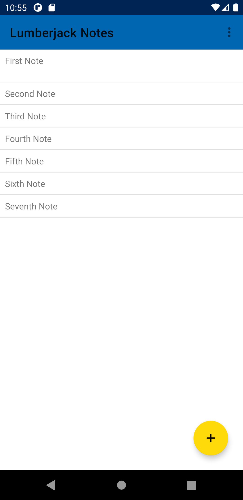
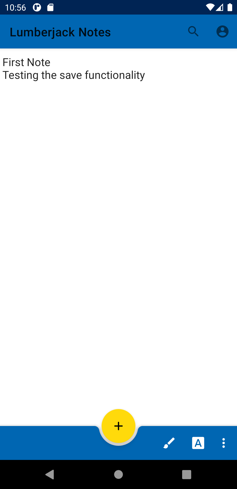
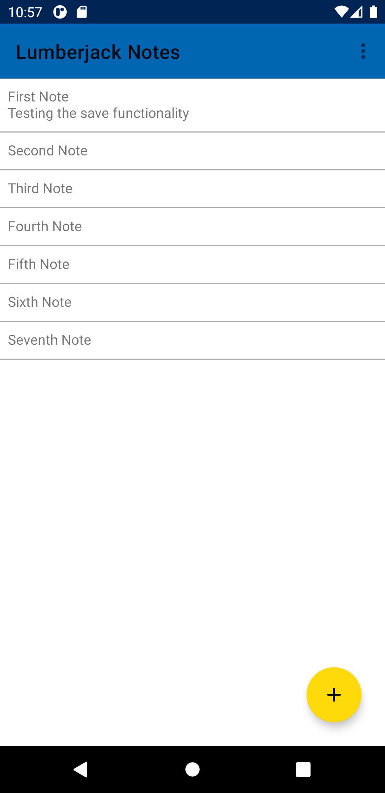
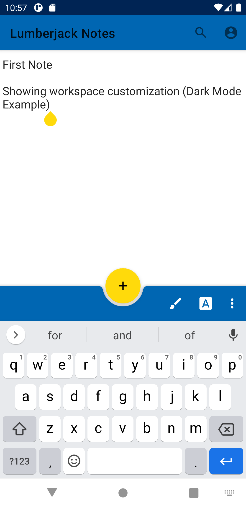
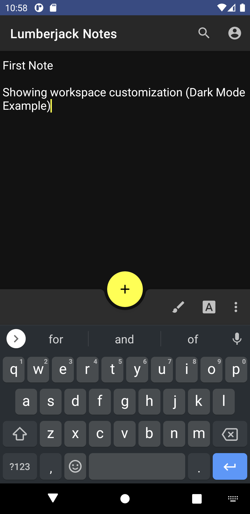

# Implementation
Group 04 - "[Lumberjack Notes]"  
Date and location: April 11, 2021  
Group Members: Gustavo Valencia, Armando Martinez, Stefan Mihailovic, Nicholas Botticelli, Collin Rampata, Kyle Austria

## 1. Introduction

Lumberjack Notes is a free note-taking application designed to help students and professionals collaborate and share
their notes with their colleagues. Our application aims to provide a user-friendly interface with an intuitive
note-taking environment. Users will have a streamlined experience to save and access notes. Users will also be able to
utilize note taking tools with the text editor at the same time making workflow more fluid.

GitHub: https://github.com/CS386-Group-4/LumberjackNotes

Trello: https://trello.com/b/3lbd1jw9/cs-386-notes-app

## 2. Implemented requirements

1. User Story: “As a college student, I want to have a streamlined experience to easily access and save notes.”  
    - Priority: 1  
    - Estimated Hours: 12

[Link to Trello Card](https://trello.com/c/PP8MOc3s)
[Link to Pull Request](https://github.com/CS386-Group-4/LumberjackNotes/pull/163)

Name of Implementer(s): [Gustavo Valencia](https://github.com/GustavoMiguelValencia) and [Nick Botticelli](https://github.com/nick-botticelli)

Name of Reviewer/Approver: [Nick Botticelli](https://github.com/nick-botticelli)

Screenshot(s) Depicting Implemented Feature:

2. User Story: "As a college student, I want to be able customize my note-taking workspace to fit my specific needs to
enhance my experience."  
    - Priority: 3  
    - Estimated Hours: 12

[Link to Trello Card](https://trello.com/c/mXxqQ24y)
[Link to Pull Request](https://github.com/CS386-Group-4/LumberjackNotes/pull/153)

Name of Implementer(s): [Collin Rampata](https://github.com/Crampata) and [Nick Botticelli](https://github.com/nick-botticelli)

Name of Reviewer/Approver: [Nick Botticelli](https://github.com/nick-botticelli)

Screenshot(s) Depicting Implemented Feature:

## 3. Demo

Demo Link: https://www.youtube.com/watch?v=RRkJhQmXec8

## 4. Code quality

## 5. Lessons learned

Over the course of the second release, our team gained knowledge in several different areas of software development.
For many members of the team, it was their first time using AWS Amplify (or any AWS Service for that matter). This
service provided us with valuable experience in back-end development and was imperative for the creation of our log-in
and sign-up features. We found the construction of this especially challenging however, and if we could start over and
select a different back-end service, our team would have used Google FireBase instead of AWS. There were several errors
that we encountered in AWS Amplify that were not included in the documentation, so solving them deemed to be very
challenging since we had nothing to reference. Despite these obstacles, our team was able to work collaboratively to
overcome them. We managed our time much better during our second release and that helped mitigate a crunch before the
deadline.
