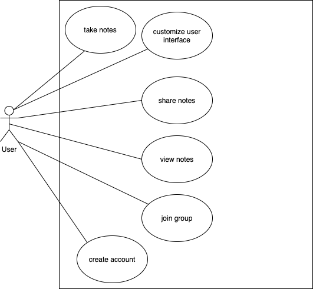

# Requirements
Group 04 - "[Lumberjack Notes]"

Date and location: February 21, 2021

Group Members: Gustavo Valencia, Armando Martinez, Stefan Mihailovic, Nicholas Botticelli, Collin Rampata, Kyle Austria

## 1. Positioning
### 1.1. Problem statement

The problem of most note-taking apps is that their unnecessary complexity affects students and professionals, the impact
of which is an inefficient workflow.

### 1.2. Product position statement

For students and professionals who need a more efficient way to take detailed notes, Lumberjack Notes is a note-taking
app that provides an accessible way to organize and share ideas, providing cloud sharing access to comfortably share
your notes with other students; unlike other famous note-taking apps like Evernote, our app will be focused on simplicity,
accessibility and mobile-centered performance to help students stay more engaged in class while taking notes.

### 1.3. Value proposition and consumer segment

**Value Proposition**

Lumberjack Notes is a free note-taking application designed to help students and professionals collaborate and share
their notes with their colleagues.

**Consumer Segment**

High school students, university students, and professionals that need a more efficient way to take detailed notes.

## 2. Stakeholders

**Users:** High school students, university students, and professionals.

**Clients:** Academic Institutions and Businesses.

**Competitors:** Evernote.

**Developers:** Gustavo Valencia, Armando Martinez, Stefan Mihailovic, Nicholas Botticelli, Collin Rampata, and Kyle Austria.

## 3. Functional requirements

- Note Sharing: Being able to share notes with colleagues.
- Ease of Use: Effective user interface.
- Customizability: Dark mode, default fonts, and moveable/removeable interface elements.

## 4. Non-functional requirements

- Availability: Assurance that servers are always operating.
- Security: Protection of user credentials and data.
- Learnability: Providing an intuitive and user-friendly user interface.
- Usability: Providing several tools to ensure efficient note-taking.

## 5. MVP

Our minimum viable product (MVP) will be an application that is initially composed of our four functional requirements,
which will include note-taking, note sharing, ease of use, and customizability. This will allow our application to be in
a state in which the functional requirements can be tested to confirm quality by limited participants within our consumer
segment. We will focus the majority of our efforts at the start on creating a platform that will allow the user to save and
create notes. After which, we will implement the rest of our functional requirements, like customization, and note sharing.

## 6. Use cases

### 6.1. Use case diagram

### 6.2. Use case descriptions and interface sketch

**Use Case**: Take Notes  
**Actor**: User  
**Description**: The user creates a page where they are able to take notes  
**Preconditions**: The user has created an account and is part of an institution or business organization  
**Post-conditions**: The user should be able to come back to their notes in the state they left their notes in  
**Main Flow**:
1. The user creates an account
2. The user has joined a group formed by either an institution or business
3. The user can write or draw notes
4. The user should be able to save their notes and come back to them at a later date

**Alternate Flow**:
- None

**Use Case:** Create group  
**Actor:** The user  
**Description:** The user creates a group to share notes with colleagues   
**Preconditions:** User is not part of a group or want to start own group   
**Post-conditions:** Own group started which can be set to private or public for other people to join  
**Main Flow:**
1. The user adds a new group
2. The user sets group name
3. The user sets privacy settings  
**Alternate Flow:**
- Other people join group without permission(public) 

**Use Case**: Customize user interface
**Actor**: User  
**Description**: The user customizes various app functionality to fit their needs.  
**Preconditions**: Create account  
**Post-conditions**: User interface is adjusted according to customizations  
**Main Flow**:
1. The user views the current settings of the application
2. The user configures the desired settings the way they want  

**Alternate Flow**:
- None 

**Use Case**: View notes 
**Actor**: User  
**Description**: The user is provided access to their notes.  
**Preconditions**: The user has an Account  
**Post-conditions**: The user can edit their notes or share them  
**Main Flow**:

1. The user selects the notes they want to view
2. The user gets access to the notes
3. The user is given the options to either edit their notes or share them  
	
**Alternate Flow**:
None 

## 7. User stories
- As a college student, I want to be able customize my note-taking workspace to fit my specific needs to enhance my
experience.

## 8. Issue tracker